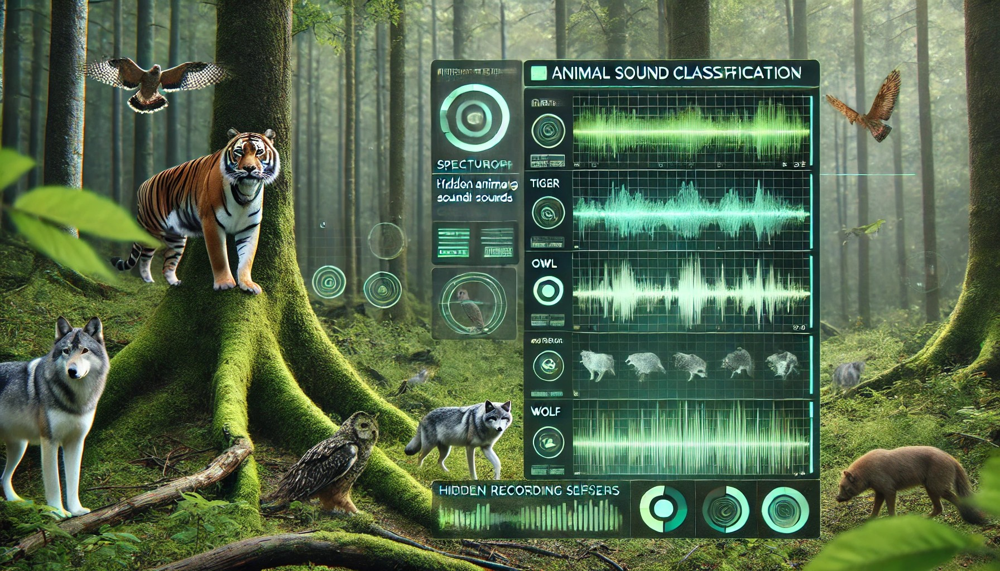

# WildEcho: Animal Sound Classification with CNN

  

## Overview
-   "WildEcho" is a deep learning project that leverages Convolutional Neural Networks (CNNs) to classify animal sounds from audio recordings. Built in Google Colab, this system processes raw audio files into Mel spectrograms and trains a CNN model to identify species such as lions, monkeys, sheep, cows, and horses. The project aims to provide an accessible, scalable solution for wildlife audio recognition, with potential applications in ecological monitoring, education, and research.

## Features
- **Audio Classification:** Identifies animals based on vocalizations.
- **Audio Preprocessing:** Converts .wav files into normalized Mel spectrograms for CNN input.
- **CNN Architecture:** A multi-layer CNN with Batch Normalization, Dropout, and MaxPooling for robust classification.
- **Training Pipeline:** Includes class weighting, early stopping, learning rate reduction, and model checkpointing.
- **Prediction:** Identifies animal species from new audio files with confidence scores.
- **Environment:** Fully implemented in Google Colab with Google Drive integration for dataset storage.

## How It Works
- **Audio Input:** The user provides an audio file containing an animal sound.
- **Preprocessing:** The system converts the audio into a Mel spectrogram, which represents the sound in a visual format.
- **Feature Extraction:** The spectrogram undergoes normalization and padding to ensure uniform input size.
- **Classification:** The CNN model analyzes the spectrogram and classifies it into one of the trained animal categories.
- **Prediction Output:** The system provides the predicted animal species along with a confidence score.

## Model Training
- Converts .wav files into Mel spectrograms.
- Uses a CNN with multiple convolutional layers.
- Implements learning rate reduction, early stopping, and model checkpointing.
- Saves the best model (best_model.keras).
  
 ## Tools Used
- **Google Colab:** Free online place to run the project.
- **Google Drive:** Stores the audio files.
- **Librosa:** Helps turn sounds into pictures.
- **TensorFlow:** Powers the CNN.

 ## Dataset Access
You can access the dataset from the following Google Drive link:
[Dataset Link](https://drive.google.com/drive/folders/1W6hzpkutT4BEexB5zqV0EGFg9v99afKO?usp=drive_link)

 ## Results
- **Training:** Learns well from the audio files. (less than 50 Epochs)
- **Testing:** Guesses animals like “Lion (90% sure)” or “Sheep (95% sure)” correctly most times.
- **How Good:** Works better with more files.

 ## Uses
 - **Wildlife Monitoring:** Detects and tracks animal species in forests for conservation.
- **Smart Farming:** Identifies animal distress sounds to monitor health and predators.
- **Education & Research:** Enhances learning with real-time sound classification.
- **Environmental Studies:** Analyzes biodiversity and ecosystem changes.
- **Pet Monitoring:** Detects distress or unusual sounds from pets.
  
 ## Contributing
Feel free to submit issues or pull requests for improvements!
