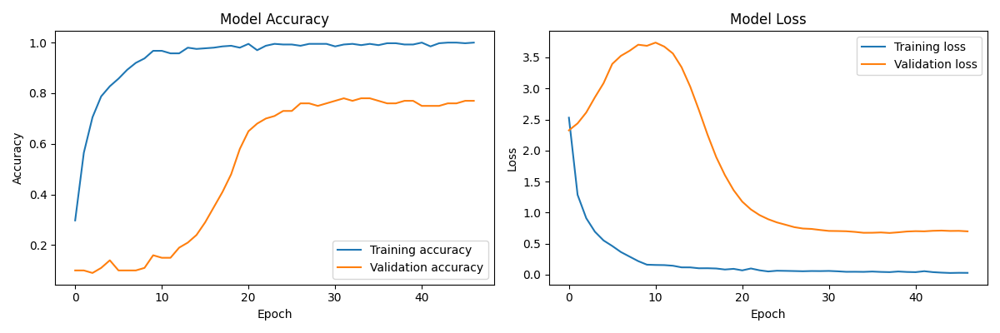

# WildEcho: Animal Sound Classification with CNN

  

## Overview
"WildEcho" is a deep learning-based project that classifies animal sounds from audio recordings using a Convolutional Neural Network (CNN). The system processes raw audio files into Mel spectrograms, trains a CNN model, and identifies animal species from vocalizations. This project has applications in wildlife monitoring, ecological research, and education. It also includes a Flask app that integrates a Safe/Unsafe category for each predicted animal based on the classification.

## Features
- **Audio Classification:** Identifies animals based on vocalizations.
- **Audio Preprocessing:** Converts .wav files into normalized Mel spectrograms for CNN input.
- **CNN Architecture:** Multi-layer CNN with Batch Normalization, Dropout, and MaxPooling for robust classification.
- **Training Pipeline:** Includes class weighting, early stopping, learning rate reduction, and model checkpointing.
- **Prediction:** Classifies animal sounds with confidence scores.
- **Safe/Unsafe Categorization:** Categorizes animals into Safe or Unsafe categories based on predefined logic in the Flask app and UI.
- **Flask App Integration:** Web-based interface for receiving audio files, processing them, and displaying results along with safety categorization.

## Class Distribution

| Class    | Count | Class   | Count |
|----------|-------|---------|-------|
| Bear     | 50    | Elephant| 50    |
| Cat      | 50    | Horse   | 50    |
| Cow      | 50    | Lion    | 50    |
| Dog      | 50    | Monkey  | 50    |
| Donkey   | 50    | Sheep   | 50    |

## How It Works
1. **Input:** User provides an audio file containing an animal sound.
2. **Preprocessing:** The system converts the audio into a Mel spectrogram.
3. **Feature Extraction:** The spectrogram undergoes normalization and padding for uniform input.
4. **Model Prediction:** The CNN model analyzes the spectrogram to classify the sound.
5. **Safe/Unsafe Categorization:** The Flask app categorizes the predicted animal as "Safe" or "Unsafe" based on predefined logic.

## Safe and Unsafe Classification (UI-Based)
After the model prediction, the animal is classified into a safety category using the following logic:

| Animal   | Category |
|----------|----------|
| Cat      | Safe     |
| Cow      | Safe     |
| Donkey   | Safe     |
| Elephant | Safe     |
| Horse    | Safe     |
| Monkey   | Unsafe   |
| Sheep    | Safe     |
| Bear     | Unsafe   |
| Lion     | Unsafe   |
| Dog      | Unsafe   |

This categorization is handled in the Flask app and UI, separate from the model's predictions.

## Model Training
- Converts `.wav` files into Mel spectrograms for feature extraction.
- CNN with multiple convolutional layers, BatchNormalization, and Dropout layers.
- Implements learning rate reduction, early stopping, and model checkpointing.
- The trained model is saved as `best_model.keras`.

  

## Classification Report

| Animal   | Precision | Recall | F1-Score | Support |
|----------|-----------|--------|----------|---------|
| Elephant | 0.88      | 0.70   | 0.78     | 10      |
| Bear     | 0.82      | 0.90   | 0.86     | 10      |
| Horse    | 0.71      | 1.00   | 0.83     | 10      |
| Lion     | 0.82      | 0.90   | 0.86     | 10      |
| Dog      | 0.89      | 0.80   | 0.84     | 10      |
| Donkey   | 0.89      | 0.80   | 0.84     | 10      |
| Cat      | 0.70      | 0.70   | 0.70     | 10      |
| Sheep    | 0.78      | 0.70   | 0.74     | 10      |
| Cow      | 1.00      | 0.90   | 0.95     | 10      |
| Monkey   | 0.90      | 0.90   | 0.90     | 10      |

### Overall Metrics:
- **Accuracy:** 0.83  
- **Macro Avg:** Precision: 0.84 | Recall: 0.83 | F1-Score: 0.83  
- **Weighted Avg:** Precision: 0.84 | Recall: 0.83 | F1-Score: 0.83  

## Flask App Integration
The Flask-based interface allows users to:
- Upload an audio file.
- Receive the model's prediction for the animal species.
- View the safety status (Safe/Unsafe) of the predicted animal.
- The UI-based logic categorizes animals like "Bear" and "Lion" as Unsafe, while animals like "Cat" and "Cow" are Safe.

## Tools Used
- **Google Colab:** For model development and training.
- **Google Drive:** To store audio files.
- **Librosa:** For audio preprocessing and conversion to Mel spectrograms.
- **TensorFlow/Keras:** For building and training the CNN model.
- **Flask:** To serve the model and provide a web interface for predictions.

## Dataset Access
You can access the dataset from the following Google Drive link:  
[Dataset Link](https://drive.google.com/drive/folders/1W6hzpkutT4BEexB5zqV0EGFg9v99afKO?usp=drive_link)

## Results
- **Training:** Achieved strong performance with fewer than 50 epochs.
- **Testing:** Provides accurate predictions such as “Lion (90%)” or “Sheep (95%)”.
- **Performance:** Works well with large, diverse audio datasets.

## Applications
- **Wildlife Monitoring:** Detects and tracks animal species in forests and conservation areas.
- **Smart Farming:** Helps farmers detect animal distress or predator sounds.
- **Education & Research:** Facilitates real-time sound classification for ecological learning.
- **Environmental Studies:** Analyzes biodiversity and ecosystem health based on animal vocalizations.
- **Pet Monitoring:** Detects unusual sounds from pets for health and behavior monitoring.
- **Camping Safety:** Detects potentially dangerous animals in the wild, helping campers stay alert and safe.

## Contributing
Feel free to submit issues or pull requests for improvements.
